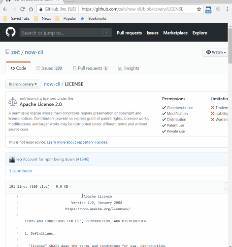

# spdx-diff

Diff selected text against SPDX licenses. Creates a browser button in Chrome to compare selected text against the SPDX [license list](https://spdx.org/licenses/).



## Installation of Prerequisites

 1. Install [node](https://nodejs.org/en/download/).
 2. Use yarn:`$ yarn install` or npm: `$ npm install`

## Usage

 1. Build the extension
  - Production: Run `$ gulp --production`
  - Development: Run `$ gulp`
 2. Load the `dist/chrome`-directory into chrome.


# Making edits

## Entryfiles (bundles)

There are two kinds of entryfiles that create bundles when `gulp` is run.

 1. All js-files in the root of the `./app/scripts` directory
 2. All css-,scss- and less-files in the root of the `./app/styles` directory

The main logic is in <app/scripts/contentscript.js> and <app/scripts/worker.js>.

## Tasks

### Build

    $ gulp


| Option         | Description                                                                                                                                           |
|----------------|-------------------------------------------------------------------------------------------------------------------------------------------------------|
| `--watch`      | Starts a livereload server and watches all assets. <br>To reload the extension on change include `livereload.js` in your bundle.                      |
| `--production` | Minifies all assets                                                                                                                                   |
| `--verbose`    | Log additional data to the console.                                                                                                                   |
| `--vendor`     | Compile the extension for different vendors (chrome, firefox, opera, edge)  Default: chrome                                                                 |
| `--sourcemaps` | Force the creation of sourcemaps. Default: !production                                                                                                |


### pack

Zips your `dist` directory and saves it in the `packages` directory.

    $ gulp pack --vendor=firefox

### Version

Increments version number of `manifest.json` and `package.json`,
commits the change to git and adds a git tag.


    $ gulp patch      // => 0.0.X

or

    $ gulp feature    // => 0.X.0

or

    $ gulp release    // => X.0.0


## Globals

The build tool also defines a variable named `process.env.NODE_ENV` in your scripts. It will be set to `development` unless you use the `--production` option.


**Example:** `./app/background.js`

```javascript
if(process.env.NODE_ENV === 'development'){
  console.log('We are in development mode!');
}
```
# Credits
- Scaffolding from  <https://github.com/HaNdTriX/generator-chrome-extension-kickstart>
- See [third-party licenses](oss-attribution/attribution.txt) for production attribution

# License
GPL-3.0 (due to stackoverflow code, which I plan to refactor out to go more permissive)
